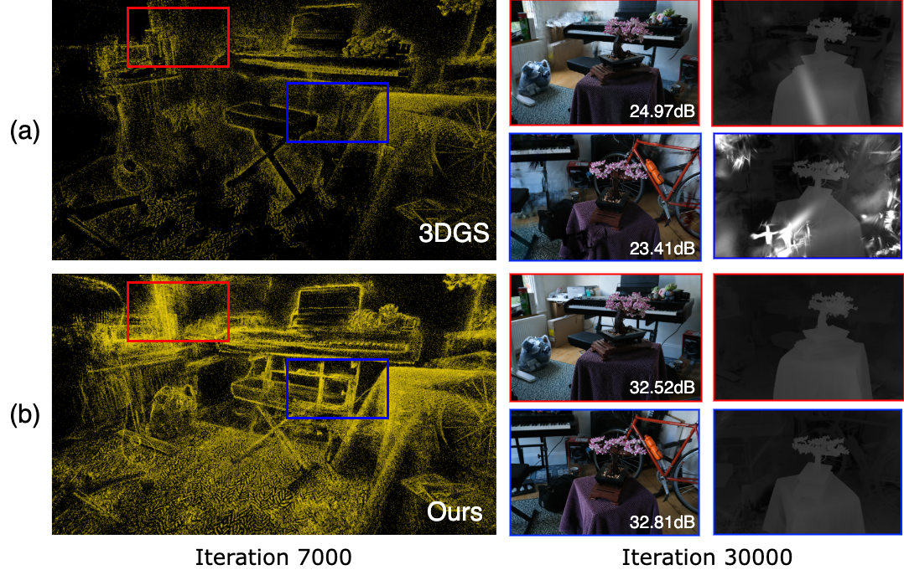

## AttentionGS: Towards Initialization-Free 3D Gaussian Splatting via Structural Attention



Abstract: 3D Gaussian Splatting (3DGS) is a powerful alternative to Neural Radiance Fields (NeRF), excelling in complex scene reconstruction and efficient rendering. However, it relies on high-quality point clouds from Structure-from-Motion (SfM), limiting its applicability. SfM also fails in texture-deficient or constrained-view scenarios, causing severe degradation in 3DGS reconstruction. To address this limitation, we propose AttentionGS, a novel framework that eliminates the dependency on high-quality initial point clouds by leveraging structural attention for direct 3D reconstruction from randomly initialization. In the early training stage, we introduce geometric attention to rapidly recover the global scene structure. As training progresses, we incorporate texture attention to refine fine-grained details and enhance rendering quality. Furthermore, we employ opacity-weighted gradients to guide Gaussian densification, leading to improved surface reconstruction. Extensive experiments on multiple benchmark datasets demonstrate that AttentionGS significantly outperforms state-of-the-art methods, particularly in scenarios where point cloud initialization is unreliable. Our approach paves the way for more robust and flexible 3D Gaussian Splatting in real-world applications.

## Cloning the Repository

The repository contains submodules, thus please check it out with 
```shell
# SSH
git clone git@github.com:graphdeco-inria/gaussian-splatting.git --recursive
```
or
```shell
# HTTPS
git clone https://github.com/graphdeco-inria/gaussian-splatting --recursive
```


## Optimizer

The optimizer uses PyTorch and CUDA extensions in a Python environment to produce trained models. 

### Hardware Requirements

- CUDA-ready GPU with Compute Capability 7.0+
- 24 GB VRAM (to train to paper evaluation quality)
- Please see FAQ for smaller VRAM configurations

### Software Requirements
- Conda (recommended for easy setup)
- C++ Compiler for PyTorch extensions (we used Visual Studio 2019 for Windows)
- CUDA SDK 11 for PyTorch extensions, install *after* Visual Studio (we used 11.8, **known issues with 11.6**)
- C++ Compiler and CUDA SDK must be compatible

### Setup

#### Local Setup

Our default, provided install method is based on Conda package and environment management:
```shell
SET DISTUTILS_USE_SDK=1 # Windows only
conda env create --file environment.yml
conda activate gaussian_splatting
```
Please note that this process assumes that you have CUDA SDK **11** installed, not **12**. For modifications, see below.

Tip: Downloading packages and creating a new environment with Conda can require a significant amount of disk space. By default, Conda will use the main system hard drive. You can avoid this by specifying a different package download location and an environment on a different drive:

```shell
conda config --add pkgs_dirs <Drive>/<pkg_path>
conda env create --file environment.yml --prefix <Drive>/<env_path>/gaussian_splatting
conda activate <Drive>/<env_path>/gaussian_splatting
```

### Running

Here's the modified documentation based on your bash script and the original format:

### Running

To run the optimizer with our modified initialization method, use:

```shell
python train.py -s <path to dataset> --random 1 --ours 1
```

For batch processing multiple scenes (as shown in **train_result.sh**), you can use:

```shell
#!/bin/bash
scenes=("bicycle" "bonsai" "counter" "garden" "kitchen" "room" "stump")

for scene in "${scenes[@]}"; do
    python train.py \
        -s "../Data/${scene}/" \
        --eval \
        -i "images_4" \
        -m "./output/${scene}/results" \
        --port 1225 \
        --random 1 \
        --ours 1
done
```

<details>
<summary><span style="font-weight: bold;">Additional Command Line Arguments for train.py</span></summary>

#### --random
Specifies the initialization method:
- `0`: Original 3DGS initialization (default)
- `1`: SLV random initialization

#### --ours
Selects between implementation versions:
- `0`: Use original 3DGS implementation
- `1`: Use our modified implementation (recommended)

#### --port
Port to use for GUI server (modified default to `1225` in our example)

#### --images / -i
Alternative subdirectory for images (modified default to `images_4` in our example)

All original arguments remain supported, including:

#### --source_path / -s
Path to the source directory containing a COLMAP or Synthetic NeRF data set.

#### --model_path / -m 
Path where the trained model should be stored (`output/<random>` by default).

#### --eval
Add this flag to use a MipNeRF360-style training/test split for evaluation.

#### --resolution / -r
Specifies resolution of the loaded images before training.

</details>
<br>

**Implementation Notes:**
1. Our method defaults to using SLV random initialization (`--random 1`) when not specified
2. The example bash script demonstrates batch processing for standard scenes
3. For evaluation, we recommend using `--eval` flag as shown in the example
4. The default image directory can be changed from `images` to `images_4` using `-i` parameter

The original functionality regarding image resolution handling remains unchanged:

> Note that similar to MipNeRF360, we target images at resolutions in the 1-1.6K pixel range. For convenience, arbitrary-size inputs can be passed and will be automatically resized if their width exceeds 1600 pixels. We recommend to keep this behavior, but you may force training to use your higher-resolution images by setting `-r 1`.
